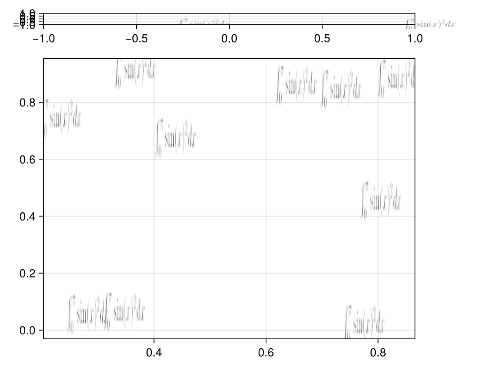
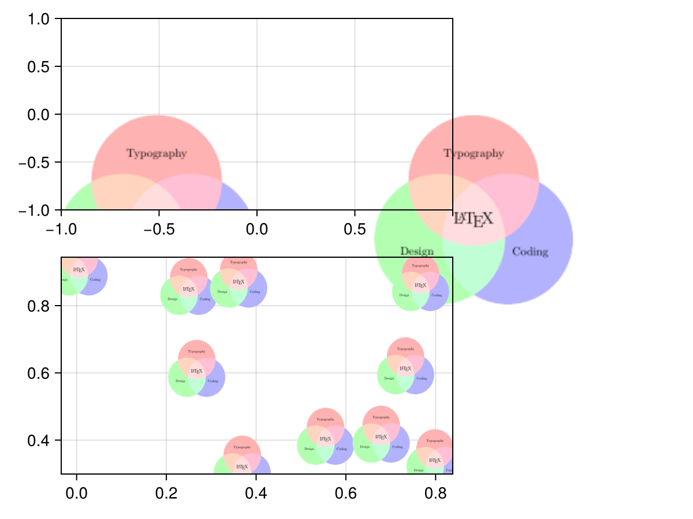
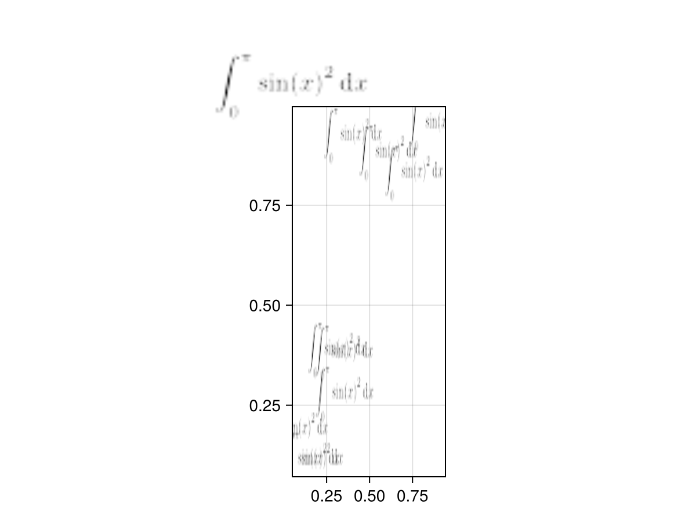
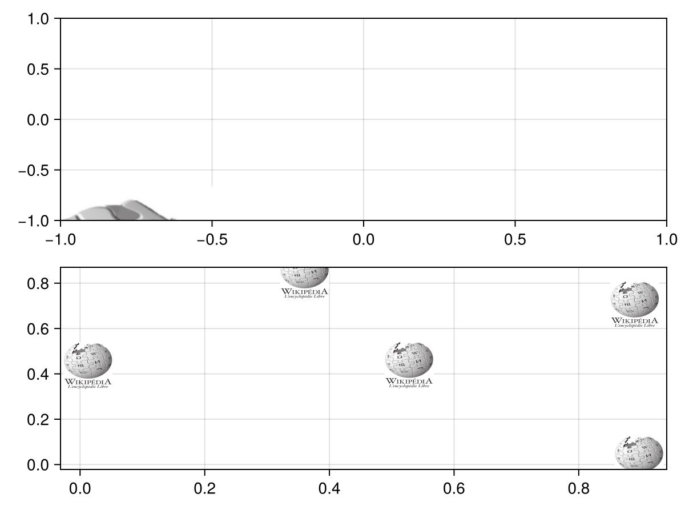
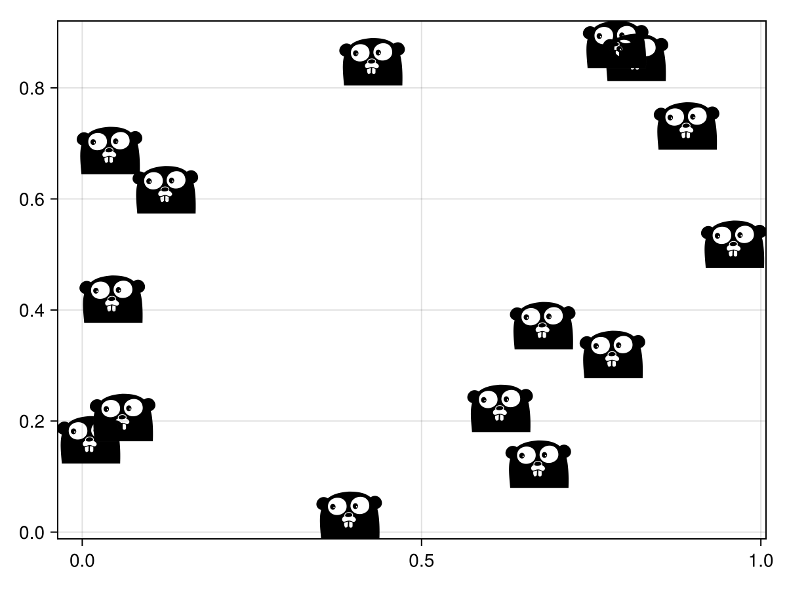

# Available formats {#Available-formats}

MakieTeX allows rendering PDF, SVG, and TeX documents in Makie.  The easiest way to construct these is to use the constructors of the form:

## TeX {#TeX}

```julia
using MakieTeX, CairoMakie
# Any of the below things could be used in place of the other.
# However, `scatter` will not accept LaTeXStrings as markers.
latex_string = L"\int_0^\pi \sin(x)^2 dx"
tex_document = TEXDocument(latex_string)
cached_tex = CachedTEX(tex_document)

fig = Figure()
# use the teximg recipe
teximg(fig[1, 1], latex_string)
# use the LTeX block
LTeX(fig[1, 2], tex_document)
# use the latex as a scatter marker
scatter(fig[2, 1], rand(10), rand(10), marker=cached_tex, markersize = 50)
fig
```

{width=600px height=450px}

You can also pass a full LaTeX document if you wish:

```julia
using MakieTeX, CairoMakie
doc = raw"""
% A Venn diagram with PDF blending
% Author: Stefan Kottwitz
% https://www.packtpub.com/hardware-and-creative/latex-cookbook
\documentclass[border=10pt]{standalone}
\usepackage{tikz}
\begin{document}
\begin{tikzpicture}
  \begin{scope}[blend group = soft light]
    \fill[red!30!white]   ( 90:1.2) circle (2);
    \fill[green!30!white] (210:1.2) circle (2);
    \fill[blue!30!white]  (330:1.2) circle (2);
  \end{scope}
  \node at ( 90:2)    {Typography};
  \node at ( 210:2)   {Design};
  \node at ( 330:2)   {Coding};
  \node [font=\Large] {\LaTeX};
\end{tikzpicture}
\end{document}
"""

tex_document = TEXDocument(doc)

fig = Figure()
# use the teximg recipe
teximg(fig[1, 1], tex_document)
# use the LTeX block
LTeX(fig[1, 2], tex_document)
# use the latex as a scatter marker
scatter(fig[2, 1], rand(10), rand(10), marker=tex_document, markersize = 50)
fig
```

{width=600px height=450px}

## Typst {#Typst}

```julia
using MakieTeX, CairoMakie

typst_string = typst"$ integral_0^pi sin(x)^2 dif x $";
typst_document = TypstDocument(typst_string);
cached_typst = CachedTypst(typst_document);

fig = Figure();
LTeX(fig[1, 1], typst_document; scale = 2);
scatter(fig[2, 1], rand(10), rand(10), marker=cached_typst, markersize = 50)
fig
```

{width=600px height=450px}

## PDF {#PDF}

```julia
using MakieTeX, CairoMakie
pdf_doc = PDFDocument(read(download("https://upload.wikimedia.org/wikipedia/commons/0/05/Wikipedia-logo-big-fr.pdf")));
fig = Figure()
# use the teximg recipe
teximg(fig[1, 1], pdf_doc)
# use the LTeX block
# LTeX(fig[1, 2], pdf_doc)
# use the latex as a scatter marker
scatter(fig[2, 1], rand(5), rand(5), marker=Cached(pdf_doc), markersize = 50)
fig
```

{width=600px height=450px}

## SVG {#SVG}

The same thing as PDF applies to SVG.

However, if you are using scatter in CairoMakie, then the SVG will be colored by the color of the marker.  This is not the case in WGLMakie or GLMakie.

See below for an example:

```julia
using MakieTeX, CairoMakie
svg = SVGDocument(read(download("https://raw.githubusercontent.com/file-icons/icons/master/svg/Go-Old.svg"), String));
fig = Figure()
scatter(fig[1, 1], rand(10), rand(10), marker=Cached(svg), markersize = 50)
scatter!(rand(5), rand(5), marker=Cached(svg), markersize = 50, strokecolor = :green, strokewidth = 7)
fig
```

{width=600px height=450px}
